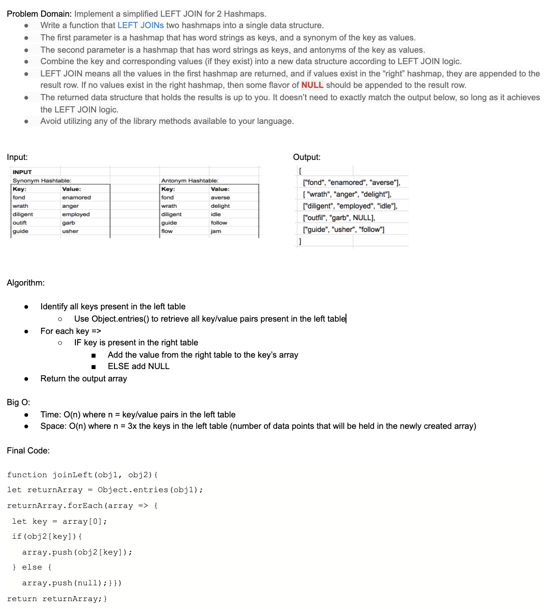

# `Left Join`

> [code](left-join.test.js)

### Challenge

- [x] Left join two hashmaps into a single data structure

- [x] Use left join logic

- [x] If there is not a value for a row when joining return null

- [x] Not using ant built in methods

### Approach & Efficiency

- Time: O(n)
- Space: O(n)

### Solution

> 
