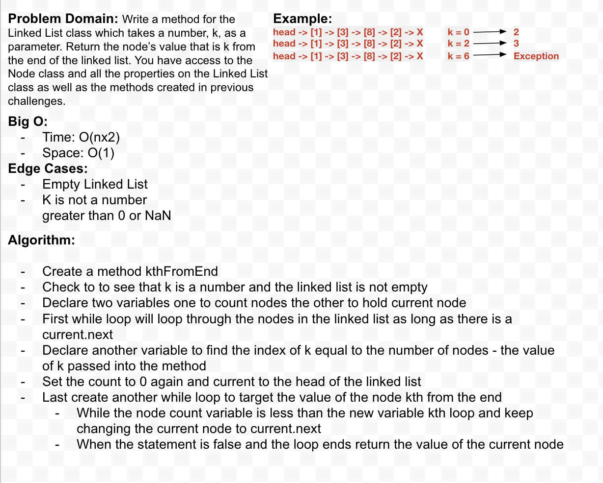

# `Linked Lists Kth From the End`
> [code](link-list-kth-from-end.test.js)
### Challenge
- [x] Class to store value and pointer to next
- [x] Have a Node that is Head
- From starting with empty Linked List ...
    - [x] Take an argument, adds new node with value of head ( O(1) Time performance )
    - [x] Method no arguments, returns string of list ex. "{ a } -> { b } -> { c } -> NULL"
- Tests for ...
    - [x] Instantiate empty list
    - [x] Insert multiple Nodes
    - [x] Return string of all Nodes in list ex. "{ a } -> { b } -> { c } -> NULL"

### Approach & Efficiency

### Solution
> 