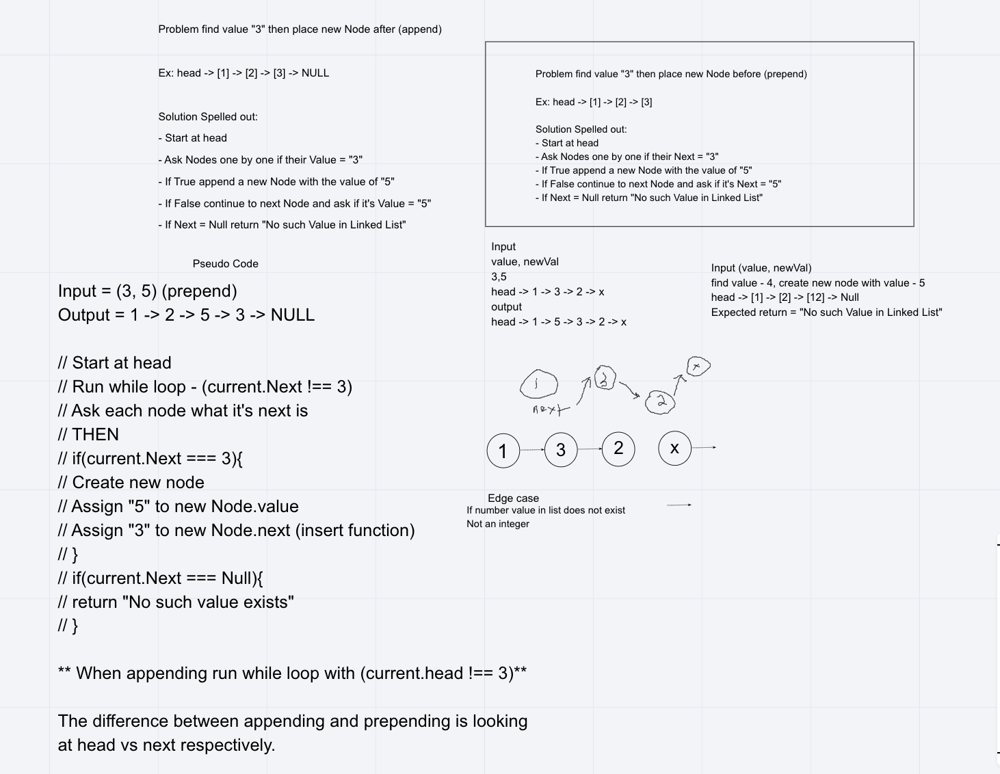

# `Linked Lists Insert`
> [code](linked-list-insert.test.js)
### Challenge
- [x] insantiates empty linked list
- [] Each Node have a value stored and next property pointing to next Node 
- [x] Have a Node that is defined as Head
- [x] Methode called *insert* take in argument and adds new node that takes command as Head with O(1) time performance
- [] Method called *includes* takes an argument and returns a boolean if value exists in list
- [] Method called *toString* takes no argument returns list as a string
- [] Throw error (semanticaly) with what went wrong if error
- [] Test for all above and passing

### Approach & Efficiency

### Solution
> 

# `Linked Lists`
> [code](linked-list.test.js)
### Challenge
- [x] Class to store value and pointer to next
- [x] Have a Node that is Head
- From starting with empty Linked List ...
    - [x] Take an argument, adds new node with value of head ( O(1) Time performance )
    - [] Method takes in value returns boolean result if value exists in list (anywhere)
    - [] Method no agruments, returns string of list ex. "{ a } -> { b } -> { c } -> NULL"
    - [] Throw custom error
- Tests for ...
    - [x] Instantiate empty list
    - [x] Add into list from front and back while keeping all Nodes
    - [x] Head is recognized as first Node
    - [x] Insert multiple Nodes
    - [] Boolean result for finding values in list
    - [] Return string of all Nodes in list ex. "{ a } -> { b } -> { c } -> NULL"

### Approach & Efficiency

### Solution

