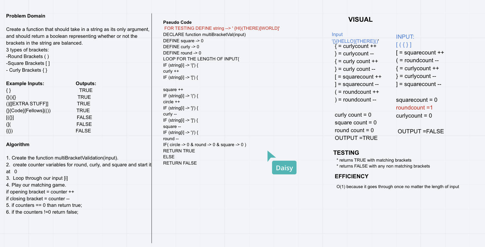

# `Multi-Bracket Validation`
> [code](multi-bracket-val.test.js)
### Challenge
- [x] Return true if every bracket has a counterpart
- [x] Return false if there are brackets missing counterparts 
- [x] Return false if there is no string, string is empty, spring is no etc.

### Approach & Efficiency

### Solution
> 