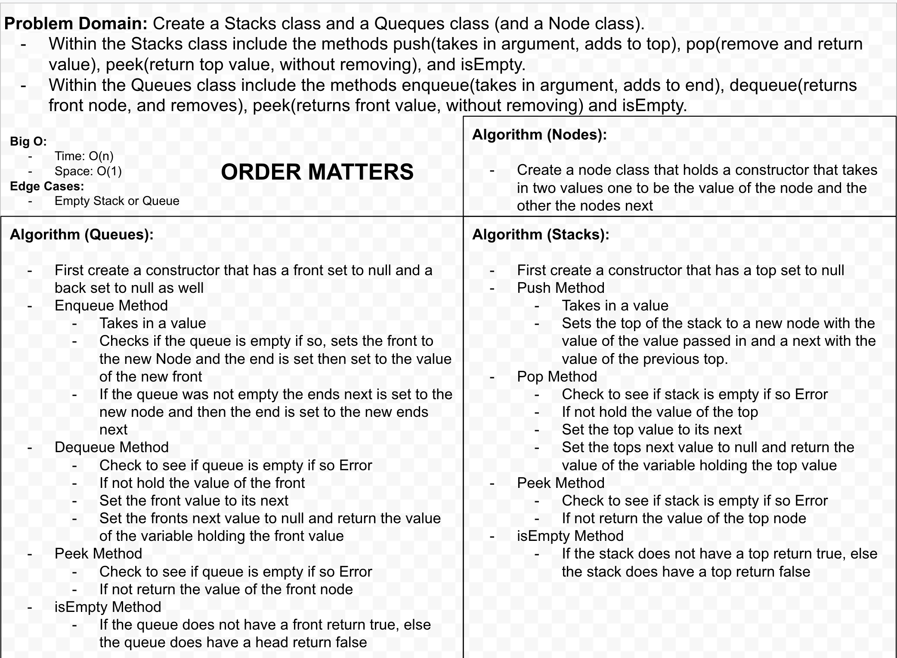

# `Stack and Queue`

> [code](stack-and-queue.test.js)

### Challenge

##### Stacks

- [x] Can successfully instantiate an empty stack
- [x] Can successfully push multiple values onto a stack
- [x] Can successfully pop off the stack
- [x] Can successfully empty a stack after multiple pops
- [x] Can successfully peek the top item on the stack
- [x] Calling pop or peek on empty stack raises exception

##### Queues

- [x] Can successfully instantiate an empty queue
- [x] Can successfully enqueue onto a queue
- [x] Can successfully dequeue multiple values onto a queue
- [x] Can successfully empty a queue after multiple pops
- [x] Can successfully peek the front item on the queue
- [x] Calling dequeue or peek on empty queue raises exception

### Approach & Efficiency

### Solution

> 
