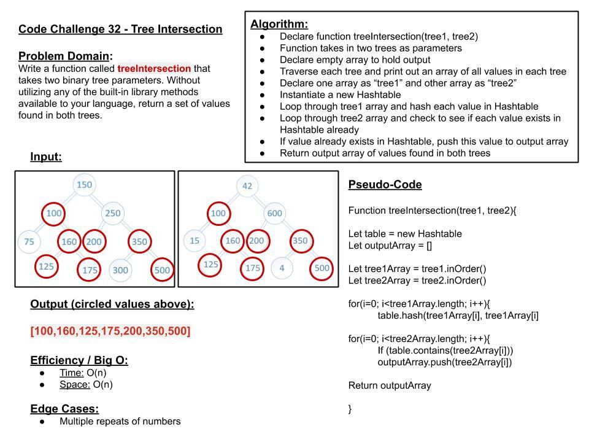

# `Tree Intersection`
> [code](tree-intersection.test.js)
### Challenge
- [x] Takes in two binary trees 

- [x] Not using ant built in methods

- [x] Return values found in both trees

- [x] Placement does not matter

### Approach & Efficiency
- Time: O(n)
- Space: O(n)

### Solution
> 